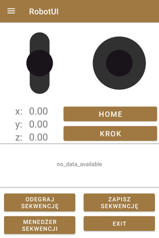
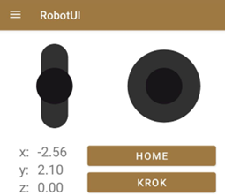
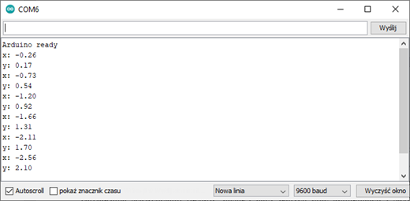
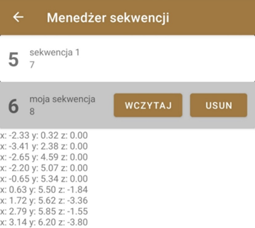

## RobotControl ##
This project was a part of my diploma work which consisted of two parts:
* Android application created in Android Studio
* Arduino server-like end which listens for incoming input

### How it works ###
After installation of the app go to Bluetooth tab where you can connect phone with Arduino board (before establishing the connection you have to bind phone with board). If connection is successful you should be able to change current coordinates by moving joystick buttons around.

These actions trigger sending currently moved axes (X and Y or Z) to the Arduino board with HC-05 module. The board then parses incoming data, updates its properties and sends back confirmation that signals the move has been done. Then robot can continue listening to new data.

The application itself includes helpful functionalities which make robot control easier, such as:
* editable list of steps
* sequences manager
* home reset button

